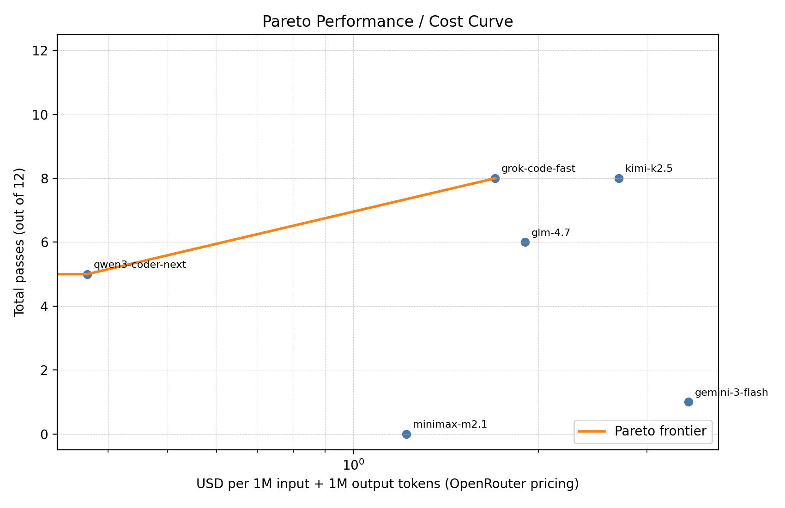

# Modern Data Benchmark (Architecture Compare)

This repository contains multiple benchmark experiments for assessing LLM performance across data architectures.

## Experiments

1. Baseline Architecture Benchmark (Typed/DBT/Drizzle/Cube)
See [artifacts/reports/modular-benchmark-writeup.md](artifacts/reports/modular-benchmark-writeup.md).

2. App + Stripe vs Warehouse + DBT Architecture Benchmark
See [artifacts/reports/architecture-benchmark-2026-02-07.md](artifacts/reports/architecture-benchmark-2026-02-07.md).

3. Linting Experiment (Option B: tsc + sqlfluff + EXPLAIN)
See [artifacts/reports/linting-experiment-2026-02-08.md](artifacts/reports/linting-experiment-2026-02-08.md).

4. Warehouse DBT Documented Sandbox Experiment
See [artifacts/reports/warehouse-dbt-documented-experiment-2026-02-09.md](artifacts/reports/warehouse-dbt-documented-experiment-2026-02-09.md).

5. Post-1 Validation: Fair DBT vs App Drizzle (stable OpenRouter set)
See [artifacts/reports/post1-validation-fair-dbt-2026-02-11.md](artifacts/reports/post1-validation-fair-dbt-2026-02-11.md).

## Report Index

Baseline (legacy modular benchmark)
- Report: [artifacts/reports/modular-benchmark-writeup.md](artifacts/reports/modular-benchmark-writeup.md)
- Legacy charts: `artifacts/reports/benchmark_*.png`

Architecture benchmark (app + Stripe vs warehouse)
- Main report: [artifacts/reports/architecture-benchmark-2026-02-07.md](artifacts/reports/architecture-benchmark-2026-02-07.md)
- Runs (multi-run): [artifacts/reports/architecture_runs_2026-02-07/](artifacts/reports/architecture_runs_2026-02-07/)
- Runs (1-pass cost-sensitive): [artifacts/reports/architecture_runs_2026-02-08/](artifacts/reports/architecture_runs_2026-02-08/)
- Runs (lint gated): [artifacts/reports/architecture_runs_2026-02-08-lint/](artifacts/reports/architecture_runs_2026-02-08-lint/)
- Runs (lint helper): [artifacts/reports/architecture_runs_2026-02-08-lint-helper/](artifacts/reports/architecture_runs_2026-02-08-lint-helper/)
- Summaries: `artifacts/reports/architecture_sampling_summary*.json`

Linting experiment (focused analysis)
- Report: [artifacts/reports/linting-experiment-2026-02-08.md](artifacts/reports/linting-experiment-2026-02-08.md)

Warehouse DBT documented sandbox (planned run)
- Report: [artifacts/reports/warehouse-dbt-documented-experiment-2026-02-09.md](artifacts/reports/warehouse-dbt-documented-experiment-2026-02-09.md)

Post-1 validation (fair DBT comparator)
- Report: [artifacts/reports/post1-validation-fair-dbt-2026-02-11.md](artifacts/reports/post1-validation-fair-dbt-2026-02-11.md)
- Stable runs: `artifacts/reports/post1_validation_runs_2026-02-11-stable/`
- Stable summary: `artifacts/reports/architecture_sampling_summary_post1-fair-2026-02-11-stable.json`

## Architecture Diagrams

Detailed Mermaid diagrams comparing the warehouse-dbt and app-drizzle architectures:

- **[Main report](artifacts/reports/architecture-benchmark-2026-02-07.md#architecture-diagrams)** — Warehouse + dbt, App + Drizzle ORM, side-by-side agent navigation, all three sandboxes
- **[blog/diagrams.md](../blog/diagrams.md)** — Full set including supporting diagrams (agent context, indirection problem, information density, layer count, join key discovery)

## Cost Curve

**Pareto Performance / Cost Curve**


Cost is plotted as **USD per 1M input + 1M output tokens** using the provided price list (log scale on the x‑axis). Claude Haiku 4.5 uses Anthropic’s published pricing.

## Project Structure

```
architecture-compare/
├── README.md
├── _summary.md
├── artifacts/                 # Reports + charts
├── data/                      # Synthetic JSON datasets
├── sandboxes/                 # Typed/DBT/Drizzle/Cube + architecture sandboxes
├── scripts/                   # Benchmarks + smoke tests
└── legacy/                    # Archived scaffolds + older benchmarks
```
