# Architecture Benchmark (App + Stripe vs Warehouse + DBT)

Date: February 7, 2026

## Objective

Evaluate whether **unified app + Stripe analytics** (TypeScript/Drizzle) leads to higher model success than a **separate warehouse + DBT** architecture where app data is replicated and unified with Stripe in the warehouse.

This experiment intentionally tests schema discovery and unification because the model must interpret staging models and join keys without extra hints.

## Method Summary

**Sandboxes**
- `app-typed`: TypeScript functions operating on app + Stripe data in a single context.
- `app-drizzle`: Drizzle ORM over a unified SQLite database containing app + Stripe tables.
- `warehouse-dbt`: SQL models executed in DuckDB over warehouse-style raw tables with staging/marts.

## Architecture Diagrams

**App + Stripe (TypeScript / app-typed)**
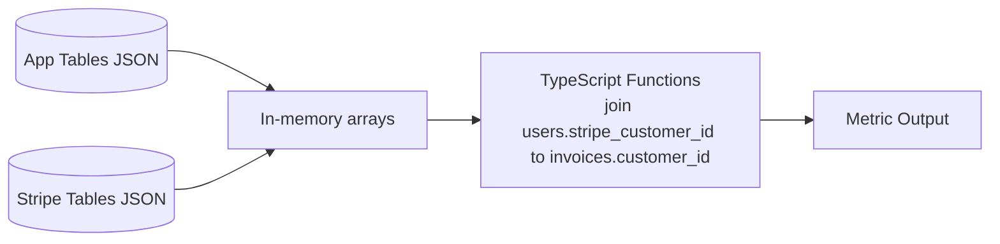

**App + Stripe (Drizzle / app-drizzle)**
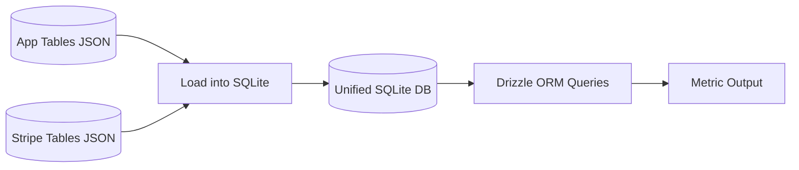

**Warehouse + DBT (warehouse-dbt)**
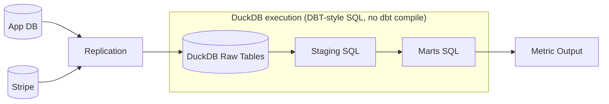

**Tasks (all require app ↔ Stripe joins)**
1. **Active User ARPU**
   - Paid invoice total for active users / count of active users.
   - Active users = users with API usage in last 30 days relative to latest `api_usage.created_at`.
2. **Organization Churn Rate**
   - Orgs with no active subscriptions AND no recent API usage / orgs with at least one user.
3. **Average Org LTV**
   - Average over orgs of sum of paid invoices tied to users in the org.

**Data/Join Keys**
- App users map to Stripe customers via `users.stripe_customer_id` → `invoices.customer_id`.
- Org membership via `users.organization_id`.
- Time anchor derived from `api_usage.created_at`.

**Validation**
- Numeric outcome validation with tolerance.
- No schema hints or helper views are provided (schema discovery is part of the test).

**Smoke Test**
- `scripts/architecture-smoke-test.ts` writes known-correct implementations into each sandbox.
- All three new sandboxes passed, confirming validators are not overly strict.

## Expected Values (Synthetic Dataset)

- Active user ARPU: **85365**
- Organization churn rate: **0**
- Average org LTV: **811610**

## Runs

Commands used:
```bash
# Sonnet
ANTHROPIC_API_KEY=... node --experimental-strip-types scripts/architecture-benchmark.ts --sandbox=app-typed --model=claude-sonnet-4-20250514
ANTHROPIC_API_KEY=... node --experimental-strip-types scripts/architecture-benchmark.ts --sandbox=app-drizzle --model=claude-sonnet-4-20250514
ANTHROPIC_API_KEY=... node --experimental-strip-types scripts/architecture-benchmark.ts --sandbox=warehouse-dbt --model=claude-sonnet-4-20250514

# Opus
ANTHROPIC_API_KEY=... node --experimental-strip-types scripts/architecture-benchmark.ts --sandbox=app-typed --model=claude-opus-4-5
ANTHROPIC_API_KEY=... node --experimental-strip-types scripts/architecture-benchmark.ts --sandbox=app-drizzle --model=claude-opus-4-5
ANTHROPIC_API_KEY=... node --experimental-strip-types scripts/architecture-benchmark.ts --sandbox=warehouse-dbt --model=claude-opus-4-5
```

## Results (Single Run per Model)

Pass counts are out of 3 tasks per sandbox.

| Model | app-typed | app-drizzle | warehouse-dbt |
|---|---:|---:|---:|
| claude-3-5-haiku-20241022 | 0/3 | 0/3 | 0/3 |
| claude-sonnet-4-20250514 | 1/3 | 1/3 | 0/3 |
| claude-opus-4-5 | 2/3 | 3/3 | 1/3 |

## Multi-Run Sampling (n=5 per model)

Mean passes per sandbox (out of 3 tasks), averaged over 5 runs:

| Model | app-typed | app-drizzle | warehouse-dbt | Overall (out of 9) |
|---|---:|---:|---:|---:|
| claude-3-5-haiku-20241022 | 0.40 | 0.20 | 0.00 | 0.60 |
| claude-sonnet-4-20250514 | 0.80 | 0.80 | 0.40 | 2.00 |
| claude-opus-4-5 | 2.00 | 3.00 | 1.00 | 6.00 |

Per‑run totals (out of 9):
- Haiku: 1, 0, 1, 1, 0
- Sonnet: 3, 3, 1, 1, 2
- Opus: 6, 6, 6, 6, 6

Variance plateau notes:
- **Opus** stabilizes immediately (zero variance across runs).
- **Sonnet** variance increases after run 3 and then stabilizes around ~0.9 std.
- **Haiku** fluctuates between 0–1 passes; variance remains ~0.5 and does not improve by run 5.

### Multi-Run Charts

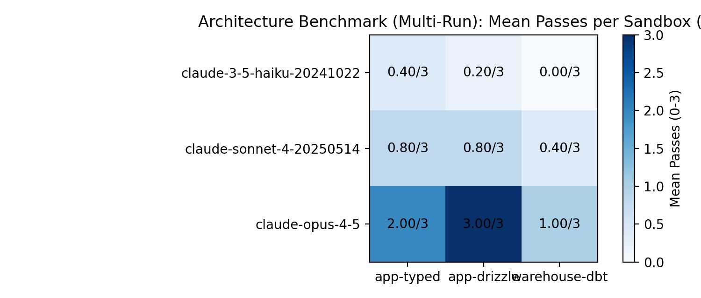

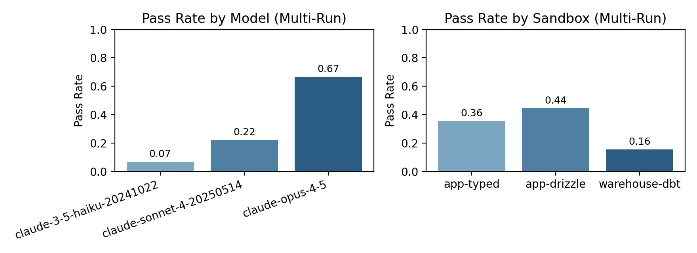

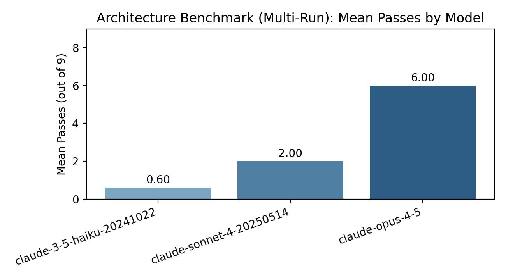

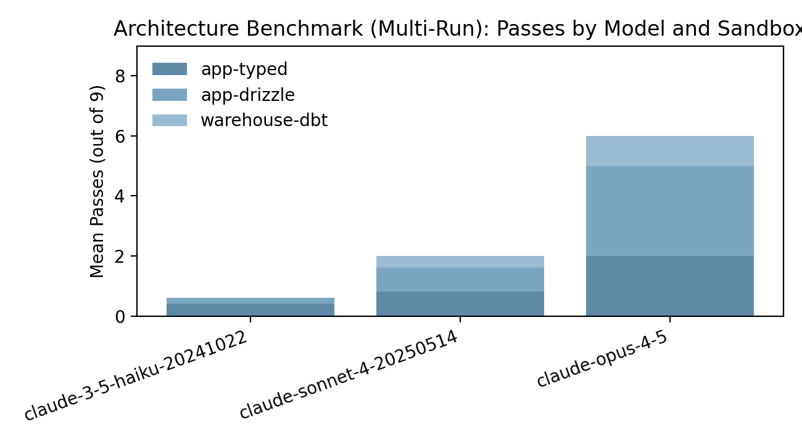

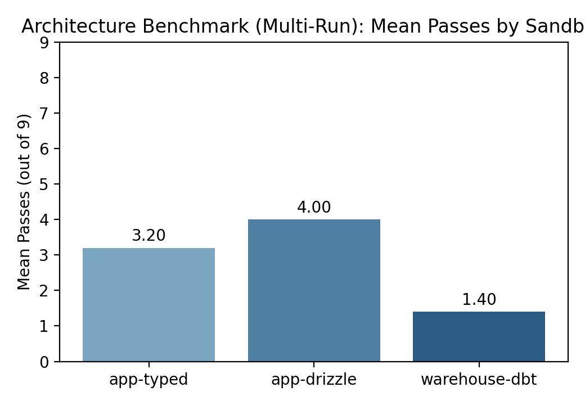

## Cost-Sensitive 1-Pass Runs (February 8, 2026)

Max turns set to **10** for cost control. These runs also include token usage logging and rubric scoring.

Pass counts are out of 3 tasks per sandbox:

| Model | app-typed | app-drizzle | warehouse-dbt | Overall (out of 9) |
|---|---:|---:|---:|---:|
| claude-3-5-haiku-20241022 | 1/3 | 0/3 | 0/3 | 1 |
| claude-sonnet-4-20250514 | 2/3 | 0/3 | 0/3 | 2 |

Token usage and cost summary:

| Model | Input tokens | Output tokens | Cost per run (USD) | Cost per pass (USD) |
|---|---:|---:|---:|---:|
| claude-3-5-haiku-20241022 | 143,657 | 24,377 | 0.0174 | 0.0174 |
| claude-sonnet-4-20250514 | 232,100 | 44,100 | 1.3578 | 0.6789 |

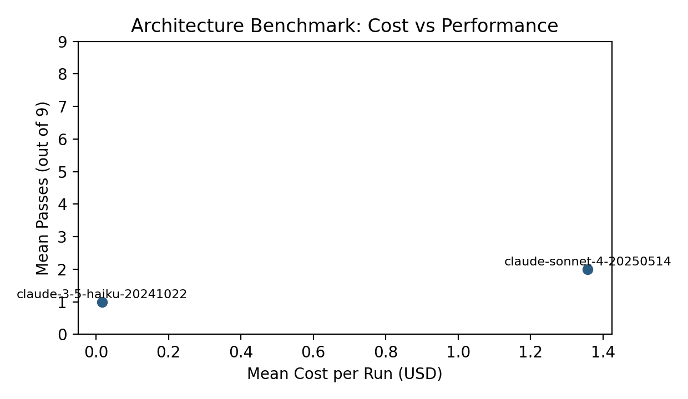

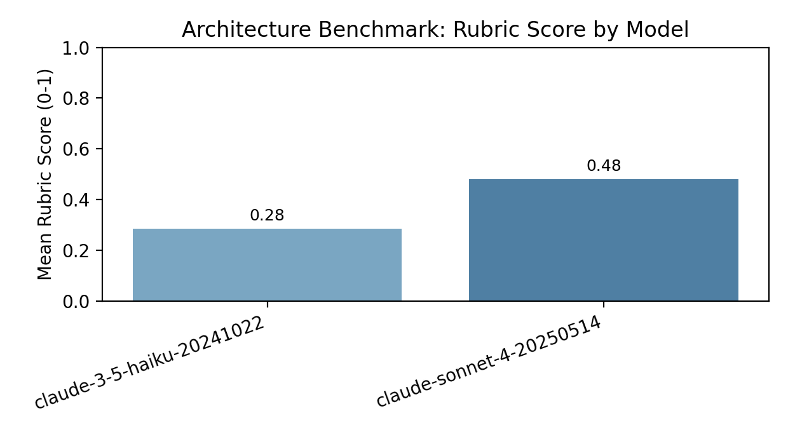

## Charts

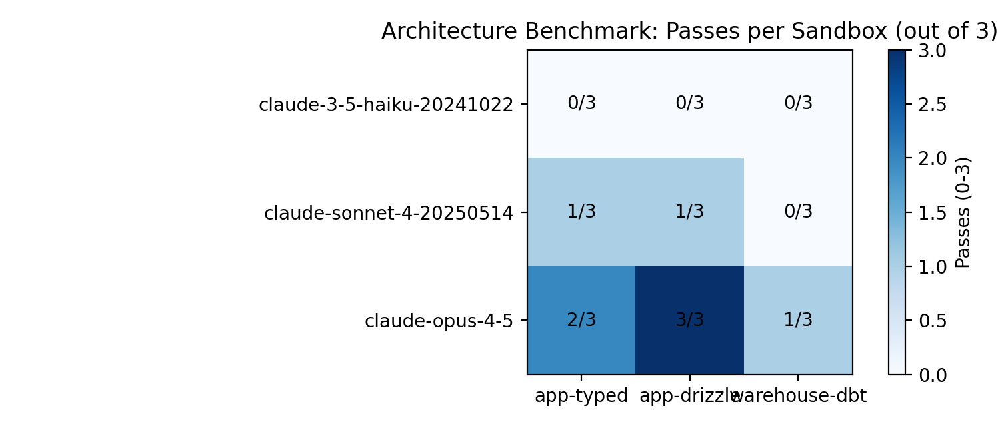

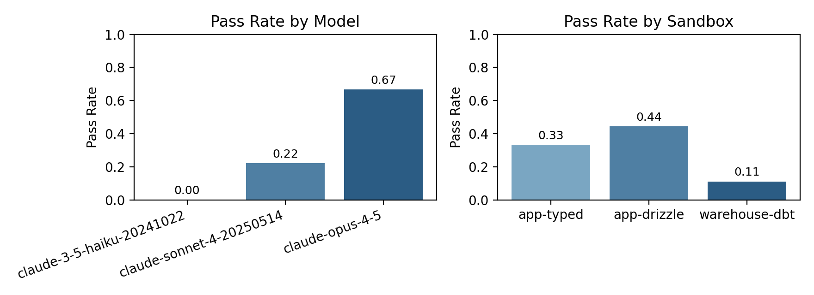

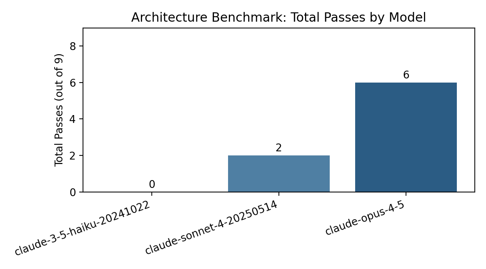

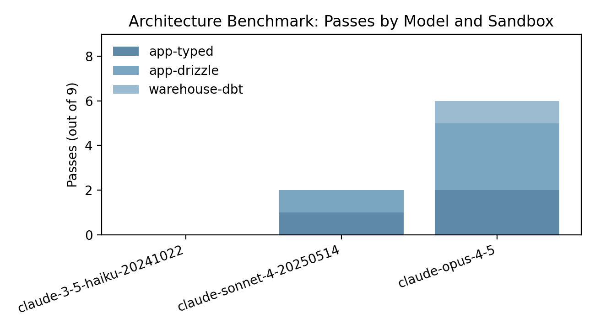

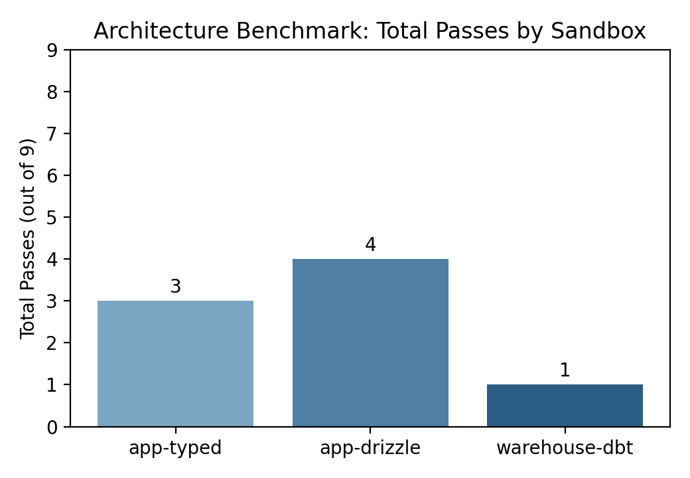

## Error Categorization

**App + Stripe (TypeScript)**
- `integration_join_error`: joining invoices via `invoice.user_id` instead of `users.stripe_customer_id → invoices.customer_id`.
- `tooling_incomplete`: missing `calculateOrgChurnRate` in some runs.
- `logic_definition_mismatch`: averaging only orgs with invoices (should include all orgs with users).

**App + Stripe (Drizzle)**
- `file_overwrite`: overwritten imports causing `db is not defined`.
- `orm_api_misuse`: unsupported patterns like `count().gt` or `users.as`.
- `query_null_result`: returned null due to malformed query / join logic.

**Warehouse + DBT**
- `schema_mismatch`: wrong column names (e.g., `created_at` vs `usage_created_at`, `org_id` vs `organization_id`).
- `type_mismatch`: interval math on VARCHAR timestamps without casting.
- `file_naming_error`: incorrect output filename or failure to write metric model.

## Findings

1. **Clear improvement from smaller to larger models**
   - Haiku fails across all sandboxes.
   - Sonnet shows partial success in app-unified sandboxes.
   - Opus succeeds fully in `app-drizzle` and partially in `app-typed`, but still struggles with warehouse DBT schema rigor.

2. **App-unified sandboxes are easier for models**
   - Both Sonnet and Opus perform better in `app-typed` and `app-drizzle` than in `warehouse-dbt`.

3. **Warehouse DBT remains hardest**
   - Failures cluster around schema discovery (staging column names) and timestamp casting.
   - This aligns with the objective to test whether the separate warehouse pattern introduces more failure surface.

4. **Multi-run sampling confirms the same ordering**
   - App‑unified sandboxes are consistently easier than warehouse DBT across models.
   - Opus is stable and strong in app‑unified sandboxes (mean 5/6 passes), but still only averages 1/3 in warehouse DBT.
   - Sonnet shows modest success in app‑unified sandboxes but low and unstable performance in warehouse DBT.
   - Haiku remains near‑zero across all sandboxes.

5. **Tool usage correlates with schema success**
   - Opus reads core schema files far more consistently, especially in `app-typed` and `warehouse-dbt`.
   - Sonnet often reads staging files in warehouse DBT but still misses the correct column names (usage_created_at vs created_at).
   - Haiku frequently skips schema files beyond the primary query file.

## Tool Usage Summary (Multi-Run)

Average unique files read per task:
- Haiku: app‑typed 1.2, app‑drizzle 1.4, warehouse‑dbt 1.1
- Sonnet: app‑typed 1.8, app‑drizzle 2.0, warehouse‑dbt 3.7
- Opus: app‑typed 3.3, app‑drizzle 2.0, warehouse‑dbt 4.4

Key schema files read (share of tasks where the file was read):
- Haiku (warehouse‑dbt): `stg_app_api_usage.sql` 13%, `stg_app_organizations.sql` 27%
- Sonnet (warehouse‑dbt): `stg_app_users.sql` 53%, `stg_app_organizations.sql` 80%
- Opus (warehouse‑dbt): `stg_app_users.sql` 100%, `stg_app_api_usage.sql` 67%

## Limitations

- Single-run snapshots are high variance; repeated runs are needed for confidence.
- Dev-complexity measures are limited to file-read counts; no turn-level or timing analysis yet.
- Drift modes exist but were not used in these runs.

## FAQ

**Is DBT being tested unfairly?**  
This benchmark is fair for the specific thing it targets: “read the schema and produce executable logic that returns the correct metric.” Every sandbox is evaluated the same way (write code → execute directly → numeric check).  
It is *not* a full dbt workflow test: there is no Jinja compilation, `ref`/`source`, materializations, or `dbt test`. If we switched to real dbt compilation, we would also need equivalent build/lint steps for the TypeScript/Drizzle/Cube sandboxes to keep parity.

**How is marking done (code correctness vs answer)?**  
Scoring is outcome‑based: code must execute and return the correct numeric value (within tolerance). There is no semantic grading beyond runtime errors and the numeric output check.

## Next Steps

- Add token usage logging for API calls and generate a Pareto cost curve for architecture runs.
- Evaluate lint/test options per sandbox (dbt compile/test with duckdb adapter, sqlfluff, TS typecheck/ESLint for typed, smoke/unit checks for drizzle, and a minimal validation check for cube measures).
- Define and test a scoring rubric beyond binary pass/fail (code correctness vs numeric correctness, schema adherence, tool usage, and partial credit).
- Add realistic drift scenarios (e.g., late-arriving Stripe invoices, missing stripe_customer_id mappings) to test robustness under sync delays.
