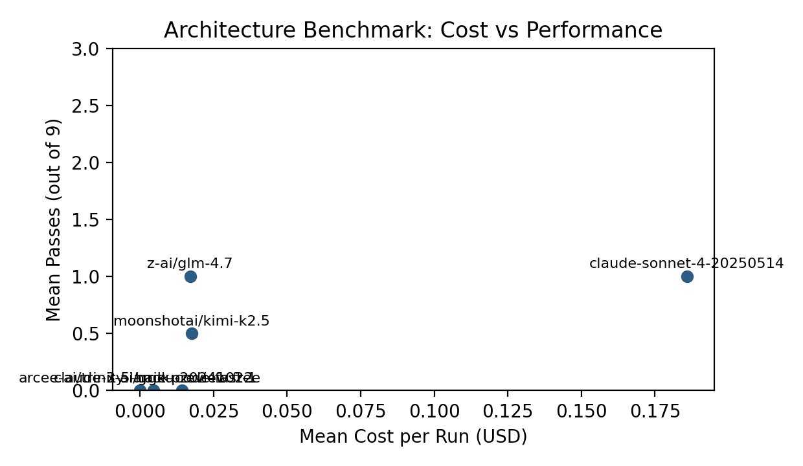
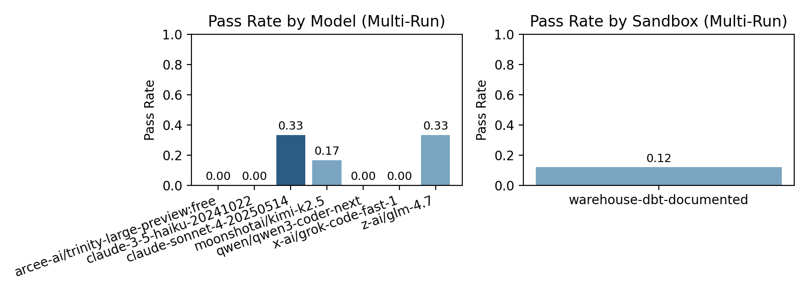

# Warehouse DBT Documented Sandbox Experiment — February 9, 2026

## Objective

Test whether providing **explicit column and join documentation** (schema.yml) in a warehouse+DBT sandbox narrows the performance gap compared to the baseline warehouse‑dbt sandbox.

This isolates the effect of `schema.yml` and documented dependencies, approximating how `ref()` + model documentation provide information density in real dbt projects.

## Hypotheses

Three possible outcomes:
1. **Gap narrows significantly** → the issue was information density, not architecture.
2. **Gap narrows slightly** → documentation helps but architecture still matters.
3. **Gap doesn’t move** → structural issues (split context, SQL indirection, casting) dominate.

## New Sandbox Variant

`warehouse-dbt-documented`
- Identical to `warehouse-dbt` in data, tasks, and validation.
- Adds a comprehensive `models/schema.yml` with column names and join hints.
- System prompt explicitly directs the model to read `models/schema.yml`.

### Documented Join Hints (examples)
- `stg_app_users.stripe_customer_id` ↔ `stg_stripe_invoices.customer_id`
- `stg_app_users.organization_id` ↔ `stg_app_organizations.organization_id`
- Invoice revenue uses `amount_paid` with `status = 'paid'`

## Method

Models (Opus excluded per request)
- `claude-3-5-haiku-20241022` (Anthropic)
- `claude-sonnet-4-20250514` (Anthropic)
- `moonshotai/kimi-k2.5` (OpenRouter)
- `z-ai/glm-4.7` (OpenRouter)
- `x-ai/grok-code-fast-1` (OpenRouter)
- `arcee-ai/trinity-large-preview:free` (OpenRouter)
- `qwen/qwen3-coder-next` (OpenRouter)

Runs
- 2 runs per model
- `--sandbox=warehouse-dbt-documented`
- Anthropic: `max-turns=10`
- OpenRouter: `max-turns=8`
- Lint disabled (`--no-lint`)

## Results Summary

Mean passes per run (out of 3 tasks) by model:

Model | Mean Passes | Run Totals
claude-3-5-haiku-20241022 | 0.0 | 0, 0
claude-sonnet-4-20250514 | 1.0 | 1, 1
moonshotai/kimi-k2.5 | 0.5 | 0, 1
z-ai/glm-4.7 | 1.0 | 1, 1
x-ai/grok-code-fast-1 | 0.0 | 0, 0
arcee-ai/trinity-large-preview:free | 0.0 | 0, 0
qwen/qwen3-coder-next | 0.0 | 0, 0

Cost per run (mean, where pricing is known):
- claude-3-5-haiku-20241022: $0.0045
- claude-sonnet-4-20250514: $0.1858
- moonshotai/kimi-k2.5: $0.0176
- z-ai/glm-4.7: $0.0171
- x-ai/grok-code-fast-1: $0.0142
- arcee-ai/trinity-large-preview:free: $0.0000
- qwen/qwen3-coder-next: n/a (pricing not provided)

## Charts





## Observations

- Documentation **did not eliminate** the dominant failure mode: time-window logic in DuckDB.
  - Many failures were the familiar `-(VARCHAR, INTERVAL)` error, indicating timestamp casting issues rather than missing columns.
- Models that succeeded did so mostly on **avg_org_ltv**; `active_user_arpu` and `org_churn_rate` were consistently harder.
- The documented schema was **frequently read**, but the wins did not meaningfully improve relative to baseline warehouse‑dbt runs.

Preliminary read: this leans toward **Outcome 3 (gap doesn’t move)**, driven by structural SQL issues rather than missing column names. More runs would be needed for confidence.

## Comparability Note

Anthropic runs used `max-turns=10` while OpenRouter runs used `max-turns=8`.
Cross‑model comparisons are approximate.

## Reproduction Commands

Anthropic example:
```bash
node --experimental-strip-types scripts/architecture-benchmark.ts \
  --sandbox=warehouse-dbt-documented \
  --model=claude-sonnet-4-20250514 \
  --max-turns=10 \
  --no-lint
```

OpenRouter example:
```bash
OPENROUTER_API_KEY=... node --experimental-strip-types scripts/architecture-benchmark.ts \
  --sandbox=warehouse-dbt-documented \
  --model=moonshotai/kimi-k2.5 \
  --max-turns=8 \
  --no-lint
```
