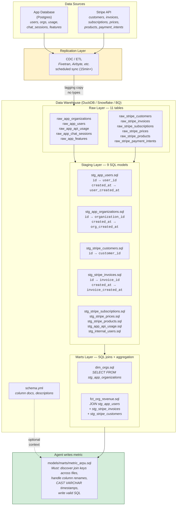
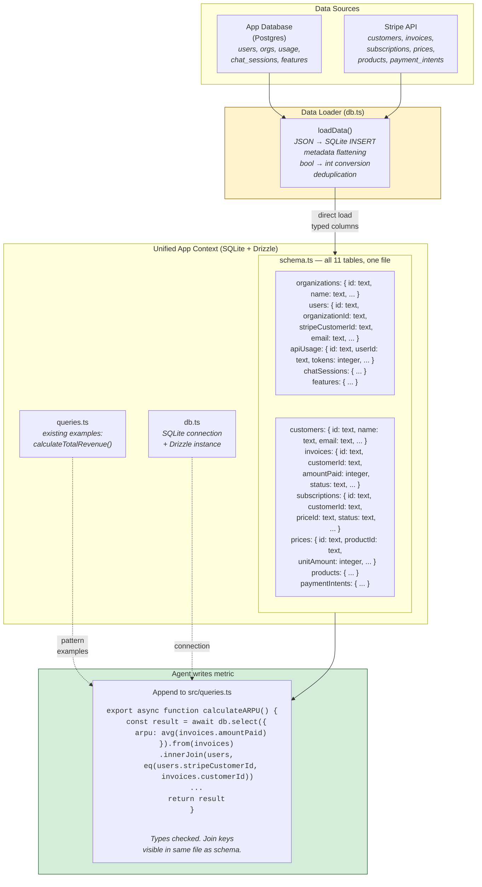
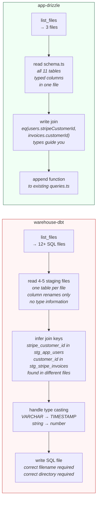
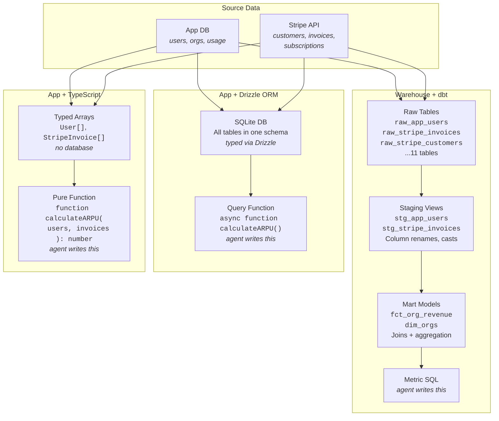
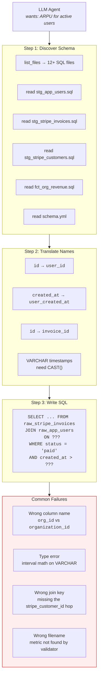
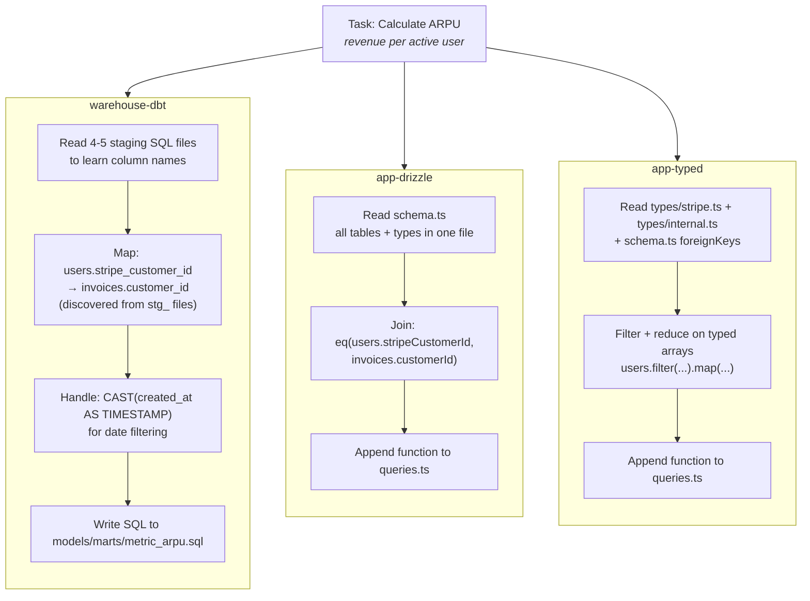
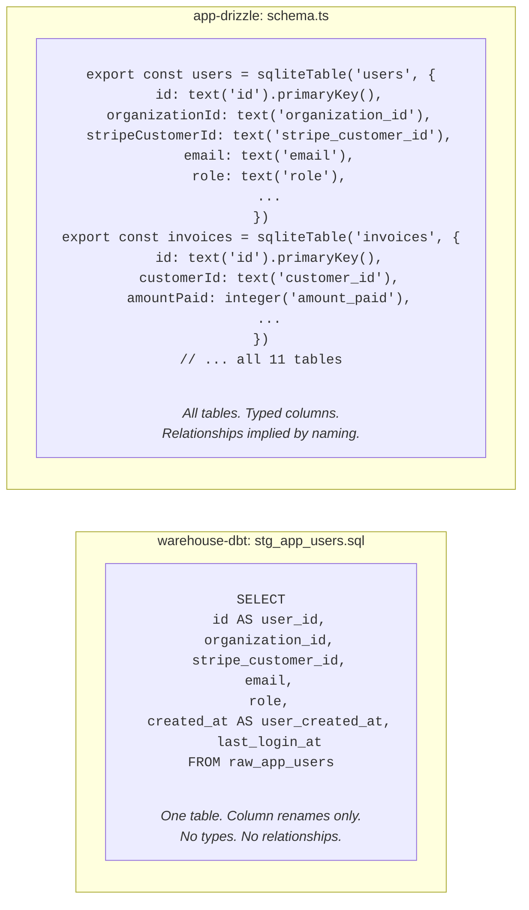

# Architecture Diagrams

## 1a. Warehouse + dbt architecture



## 1b. App + Drizzle ORM architecture



## 1c. Side-by-side: what the agent navigates



## 2. Side-by-side data flow (high level)



## 3. What the agent actually sees (context comparison)

```mermaid
graph LR
    subgraph dbt_ctx["warehouse-dbt: Agent Context"]
        direction TB
        D1["<code>models/staging/stg_app_users.sql</code>"]
        D2["<code>models/staging/stg_app_organizations.sql</code>"]
        D3["<code>models/staging/stg_stripe_customers.sql</code>"]
        D4["<code>models/staging/stg_stripe_invoices.sql</code>"]
        D5["<code>models/staging/stg_stripe_subscriptions.sql</code>"]
        D6["<code>models/staging/stg_stripe_prices.sql</code>"]
        D7["<code>models/staging/stg_stripe_products.sql</code>"]
        D8["<code>models/staging/stg_app_api_usage.sql</code>"]
        D9["<code>models/staging/stg_internal_users.sql</code>"]
        D10["<code>models/marts/dim_orgs.sql</code>"]
        D11["<code>models/marts/fct_org_revenue.sql</code>"]
        D12["<code>models/schema.yml</code>"]
    end

    subgraph orm_ctx["app-drizzle: Agent Context"]
        direction TB
        O1["<code>src/schema.ts</code>  ← types + tables"]
        O2["<code>src/db.ts</code>      ← loader"]
        O3["<code>src/queries.ts</code> ← examples"]
    end

    subgraph ts_ctx["app-typed: Agent Context"]
        direction TB
        T1["<code>src/types/internal.ts</code>  ← app types"]
        T2["<code>src/types/stripe.ts</code>    ← stripe types"]
        T3["<code>src/db/schema.ts</code>       ← foreign keys"]
        T4["<code>src/analytics/derived.ts</code> ← helpers"]
        T5["<code>src/analytics/queries.ts</code> ← examples"]
    end
```



## 4. The indirection problem (dbt detail)



## 5. The same task in each architecture



## 6. Information density per file read



## 7. Layer count (simple)

```
warehouse-dbt          app-drizzle         app-typed
─────────────          ───────────         ─────────

  JSON files             JSON files          JSON files
      │                      │                   │
      ▼                      ▼                   ▼
  Raw Tables             SQLite DB           Typed Arrays
      │                      │                   │
      ▼                      │                   │
  Staging Views              │                   │
  (column renames,           │                   │
   type casts)               │                   │
      │                      │                   │
      ▼                      │                   │
  Mart Models                │                   │
  (joins, aggs)              │                   │
      │                      │                   │
      ▼                      ▼                   ▼
  ┌────────┐           ┌────────┐           ┌────────┐
  │ Metric │           │ Metric │           │ Metric │
  │  SQL   │           │Function│           │Function│
  └────────┘           └────────┘           └────────┘

  5 layers               2 layers            2 layers
  12+ files              3 files             5 files
  0 type info            full types          full types
```

## 8. The join key discovery problem

```
ARPU requires: revenue per active user
           ┌─────────────────────────────────────────────┐
           │  The join path is the same in all three:     │
           │                                              │
           │  users.stripe_customer_id                    │
           │       ↓                                      │
           │  invoices.customer_id                        │
           │       ↓                                      │
           │  SUM(amount_paid) WHERE status = 'paid'      │
           └─────────────────────────────────────────────┘

warehouse-dbt: agent must read stg_app_users.sql to find
               stripe_customer_id exists, then read
               stg_stripe_invoices.sql to find customer_id,
               then figure out the join. These are in
               separate files with renamed columns.

app-drizzle:   agent reads schema.ts, sees both tables
               with stripeCustomerId and customerId
               in the same file. One read.

app-typed:     agent reads types + schema.ts foreignKeys:
               { users: { stripe_customer_id: 'customers.id' } }
               Relationship is explicitly documented.
```
